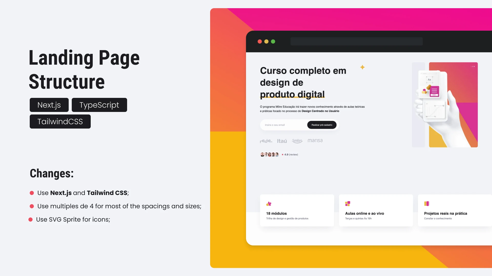

# Landing Page Structure

This repo contains the code following the [**CodeBoost** video][video] about how to structure a landing page. **Link below**👇

[![youtube][youtube]][video]

As usually, on this repo you can found some changes when compare with the course project.

## 🛠 Skills

![nextjs][nextjs] ![tailwindcss][tailwindcss] ![typescript][typescript]

## 📄 Roadmap

- [x] Use **Next.js** and **Tailwind CSS**;
- [x] Use SVG Sprite for the icons;
- [x] Convert static assets from `.png`/`.jpg` to `.webp`;
- [x] Create mobile version;
- [x] Add **ESLint** config.;
- [x] Add **Prettier** config.;
- [x] Add **commitlint**;
- [x] Add **Husky** and **LintStaged** to add commit hooks.

## 🔗 More About Me

[nextjs]: https://img.shields.io/badge/nextjs-1C1C1F?style=for-the-badge&logo=next.js&logoColor=white
[tailwindcss]: https://img.shields.io/badge/tailwindcss-1C1C1F?style=for-the-badge&logo=tailwindcss&logoColor=white
[typescript]: https://img.shields.io/badge/typescript-1C1C1F?style=for-the-badge&logo=typescript&logoColor=white
[youtube]: https://img.shields.io/badge/youtube-F04264?style=for-the-badge&logo=youtube&logoColor=white
[video]: https://youtu.be/LVv1LD7h6Jg
